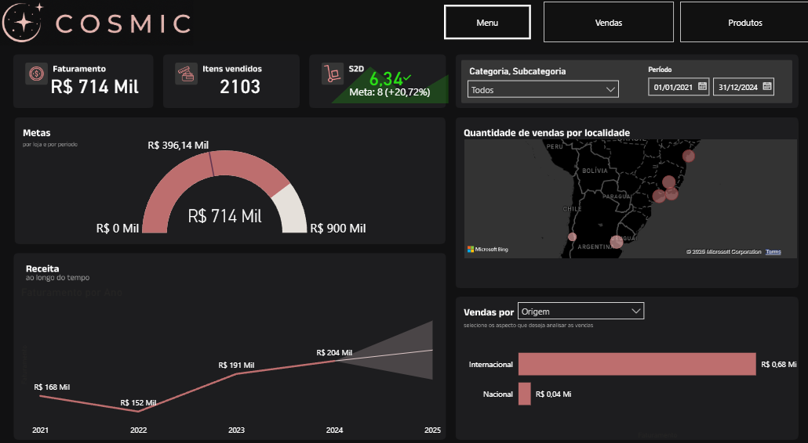

# Opuline Sales Dashboard

Business Intelligence Dashboard desenvolvido em Power BI para apoiar a tomada de decisão estratégica de uma empresa fictícia do setor de cosméticos.

**Status**: Concluído

**Tipo de projeto**: Dashboard Analítico

**Empresa**: Opuline (empresa fictícia)

**Segmento**: Cosméticos

**Ferramenta principal**: Power BI

**Objetivo**: Apoiar a tomada de decisão baseada em dados

---

## Dashboard de Vendas

---

## Sobre o projeto

A Opuline é uma empresa fictícia do setor de cosméticos que deseja adotar uma cultura orientada por dados para apoiar suas decisões estratégicas.

Neste projeto foi desenvolvido um dashboard interativo no Power BI com o objetivo de transformar dados de vendas em informações acionáveis, permitindo acompanhar indicadores de desempenho, identificar padrões de comportamento e gerar insights para o negócio.

---

## Contexto de negócio

Embora a empresa possua dados de vendas consolidados, eles não eram utilizados de forma estratégica na tomada de decisão.

O desafio deste projeto consistiu em construir um painel analítico capaz de transformar essas informações em indicadores de negócio, permitindo acompanhar desempenho comercial, comportamento temporal das vendas, distribuição geográfica, metas logísticas e performance dos produtos.

---

## Objetivo

Desenvolver um dashboard interativo que permita:

- acompanhar indicadores estratégicos;
- analisar vendas sob diferentes perspectivas;
- identificar tendências temporais;
- comparar desempenho entre categorias;
- monitorar metas;
- apoiar decisões baseadas em dados.

---

## Dashboard de Produtos

---

## Principais funcionalidades

- Monitoramento de KPIs estratégicos
- Acompanhamento de metas
- Análise temporal das vendas
- Previsão de faturamento
- Detecção de anomalias
- Análise geográfica das vendas
- Comparação dinâmica entre dimensões de negócio
- Ranking de produtos
- Análise da relação entre preço e faturamento
- Segmentações interativas

---

## Indicadores monitorados

- Faturamento
- Itens vendidos
- Ship-to-Door (S2D)

## Principais análises

- Evolução temporal do faturamento
- Comparação do faturamento entre categorias de produtos
- Comparação do faturamento por origem dos produtos
- Distribuição geográfica das vendas
- Ranking de produtos por faturamento
- Relação entre preço e faturamento
- Monitoramento do desempenho em relação às metas
- Identificação de tendências, previsões e anomalias

---

## Principais insights

- A categoria de maquiagem apresentou o maior faturamento entre todas as categorias analisadas, consolidando-se como o principal segmento de vendas da empresa.

- O faturamento superou a meta estabelecida para o período analisado, indicando desempenho comercial acima do objetivo definido.

- O indicador **Ship-to-Door (S2D)** registrou média de **6,34 dias**, superando a meta de **8 dias** em **20,72%**, evidenciando maior eficiência no processo logístico.

- A análise temporal identificou uma anomalia em **janeiro de 2022**, caracterizada por uma queda acentuada no faturamento seguida de recuperação, indicando a ocorrência de um evento atípico que impactou as vendas naquele período.

- A projeção baseada no histórico de vendas indica continuidade da tendência de faturamento, permitindo apoiar o planejamento estratégico por meio de previsões acompanhadas de intervalo de confiança.

- A análise da relação entre preço e faturamento evidenciou que produtos com maior preço tendem a concentrar também os maiores faturamentos, indicando uma associação positiva entre essas variáveis.

- A análise por localidade mostrou que a participação de produtos nacionais e internacionais varia entre as cidades, indicando diferenças regionais no comportamento de compra e oportunidades para estratégias comerciais mais direcionadas.

---

## Tecnologias utilizadas

- Power BI Desktop
- DAX
- Power Query
- Modelagem Dimensional
- Visualizações Interativas

---

## Estrutura do projeto

dashboard/

- Opuline.pbix

assets/

- dashboard-home.png
- dashboard-products.png

docs/

- dashboard.pdf

---

## Como visualizar

Caso possua o Power BI Desktop instalado, basta abrir o arquivo:

dashboard/Opuline.pbix

Também é possível visualizar uma versão estática do dashboard através do arquivo PDF disponível na pasta docs.

---

## Autor

Paulo Ricardo Costa Mariano de Souza
