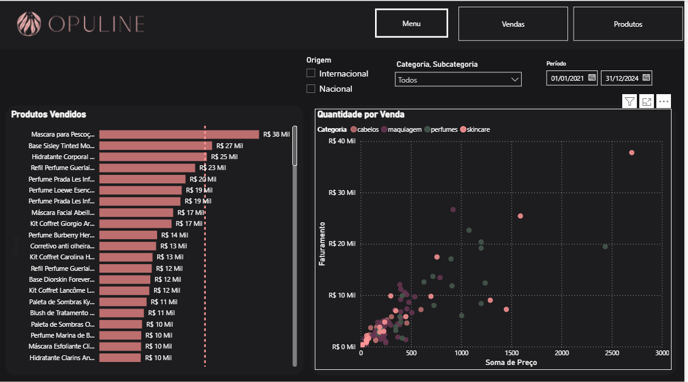

# Opuline Sales Dashboard

Business Intelligence Dashboard desenvolvido em Power BI para apoiar a tomada de decisão estratégica de uma empresa fictícia do setor de cosméticos.

---

## Dashboard

---

## Sobre o projeto

A Opuline é uma empresa fictícia do setor de cosméticos que deseja adotar uma cultura orientada por dados para apoiar suas decisões estratégicas.

Neste projeto foi desenvolvido um dashboard interativo no Power BI com o objetivo de transformar dados de vendas em informações acionáveis, permitindo acompanhar indicadores de desempenho, identificar padrões de comportamento e gerar insights para o negócio.

---

## Contexto de negócio

Embora a empresa possua dados de vendas consolidados, eles não eram utilizados de forma estratégica na tomada de decisão.

O desafio deste projeto consistiu em construir um painel analítico capaz de transformar essas informações em indicadores de negócio, permitindo acompanhar desempenho comercial, comportamento temporal das vendas, distribuição geográfica, metas logísticas e performance dos produtos.

---

## Objetivo

Desenvolver um dashboard interativo que permita:

- acompanhar indicadores estratégicos;
- analisar vendas sob diferentes perspectivas;
- identificar tendências temporais;
- comparar desempenho entre categorias;
- monitorar metas;
- apoiar decisões baseadas em dados.

---

## Dashboard de Produtos

---

## Principais funcionalidades

- KPIs estratégicos
- Navegação entre páginas
- Segmentações dinâmicas
- Parâmetro de campo
- Tooltips personalizados
- Gráfico de dispersão
- Série temporal
- Previsão
- Detecção de anomalias
- Linha de tendência
- Mapas geográficos
- Indicadores de metas
- Linha de referência
- Drill Down e Drill Up

---

## KPIs analisados

- Faturamento
- Itens vendidos
- Ship-to-Door (S2D)
- Meta mensal
- Receita ao longo do tempo
- Quantidade de vendas por localidade
- Faturamento por categoria
- Faturamento por origem
- Ranking de produtos

---

## Principais insights

Entre as análises disponibilizadas pelo dashboard destacam-se:

- acompanhamento da evolução do faturamento ao longo do tempo;
- identificação de tendências de crescimento;
- detecção de anomalias nas vendas;
- comparação entre marcas, categorias e origem dos produtos;
- identificação dos produtos com maior faturamento;
- análise da relação entre preço e faturamento através de gráfico de dispersão;
- acompanhamento do desempenho logístico utilizando o indicador Ship-to-Door;
- visualização da distribuição geográfica das vendas.

---

## Tecnologias utilizadas

- Power BI Desktop
- DAX
- Power Query
- Modelagem Dimensional
- Visualizações Interativas

---

## Estrutura do projeto

dashboard/

- Opuline.pbix

assets/

- dashboard-home.png
- dashboard-products.png

docs/

- dashboard.pdf

---

## Como visualizar

Caso possua o Power BI Desktop instalado, basta abrir o arquivo:

dashboard/Opuline.pbix

Também é possível visualizar uma versão estática do dashboard através do arquivo PDF disponível na pasta docs.

---

## Autor

Paulo Ricardo Costa Mariano de Souza
